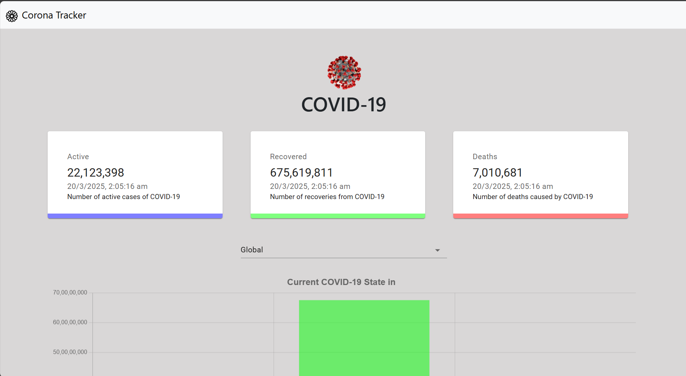
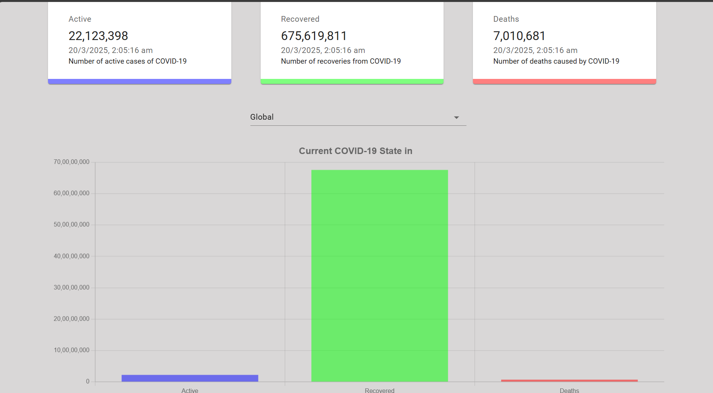
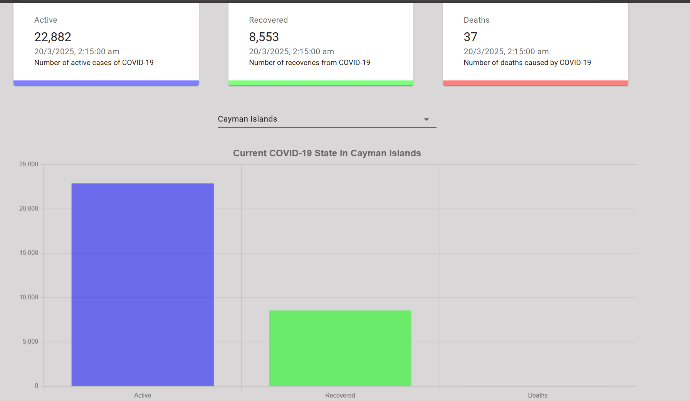

# 🦠 COVID-19 Tracker

A **responsive and real-time COVID-19 Tracker** built using **React.js** and **Chart.js**, displaying global and country-wise cases in an interactive format. It provides accurate statistics, visualizations, and safety measures to stay informed about the pandemic.

---

## 📌 Features

✅ **Live COVID-19 Statistics** (Global & Country-wise)  
✅ **Interactive Charts** (Line & Bar Graphs)  
✅ **Bootstrap UI for Professional Look**  
✅ **Google Maps Integration (Optional)**  
✅ **Real-time API Data Fetching**  
✅ **Optimized for Mobile & Desktop**  

---

## 🚀 Tech Stack

- **Frontend:** React.js, JSX, CSS Modules  
- **Data Visualization:** Chart.js, React Chart.js  
- **Styling:** Bootstrap, Google Fonts, CSS  
- **Data Source:** COVID-19 API  
- **Deployment:** Netlify / Vercel  

---

## 📷 Project Screenshots  


### **Homepage**  


### **Global Data Chart**  


### **Country-wise Data**  


---

## 🔧 Installation & Setup  

1️⃣ **Clone the Repository**  
```sh
git clone https://github.com/your-username/covid-tracker.git
cd covid-tracker
